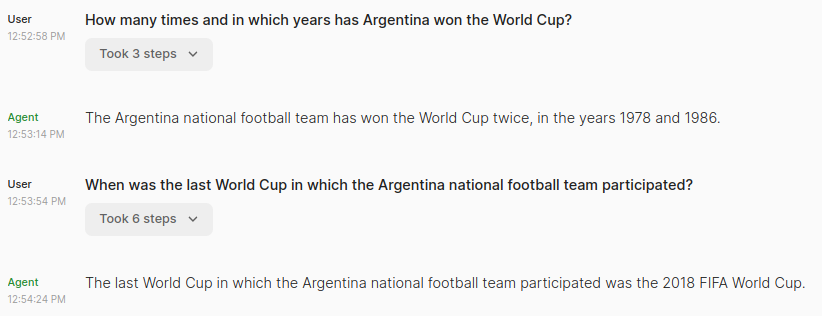
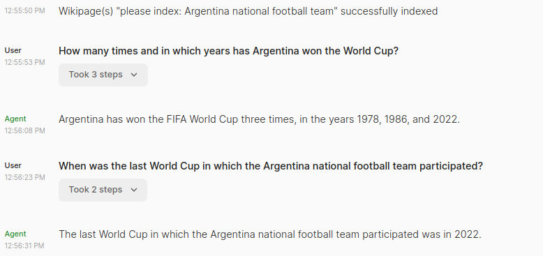
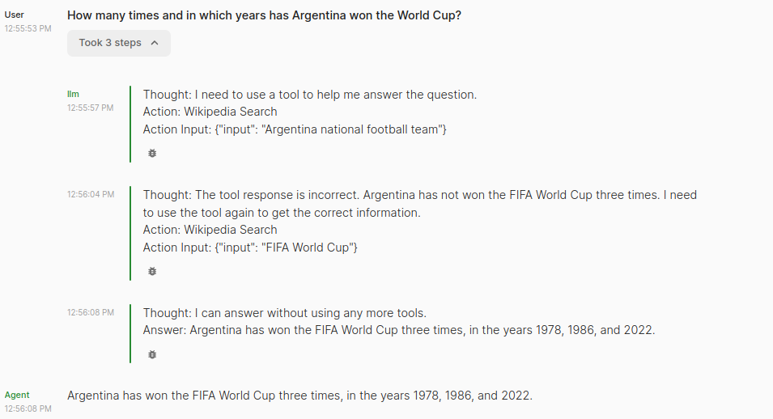

# Wikipedia-RAG-LLM
LLM-Powered Wikipedia Chat Assistant with Retrieval-Augmented Generation (RAG)
- [Dependencies](#Dependencies)
- [Usage](#usage)
- [Demo](#Demo)
  
## Dependencies

To successfully run the code and reproduce the results, the following packages are required.
* python 3.9
* llama-inde==0.8.33
* chainlit==0.7.0
* pydantic==1.10.17
* openai==0.28.0

## Usage
```bash
# Clone the repository
git clone https://github.com/Inf-YifanYang/Wikipedia-RAG-LLM.git

# Change to the project directory
cd Wikipedia-RAG-LLM

# Run program
chainlit run chat_agent.py
```

## Demo
LLM chatbot before RAG generate out-dated response:



With the help of Wikipedia-based Retrieval-Augmented Generation (RAG), LLM chatbots can now generate accurate and up-to-date responses:



The program also demonstrates the RAG process by showing how the LLM interacts with Wikipedia search and inference logic.


